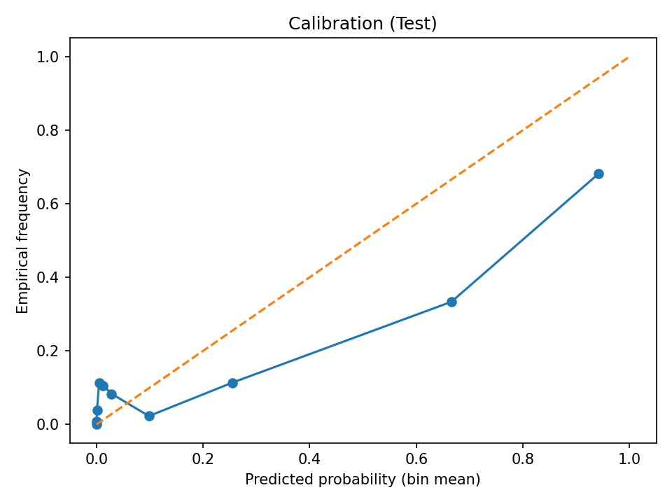
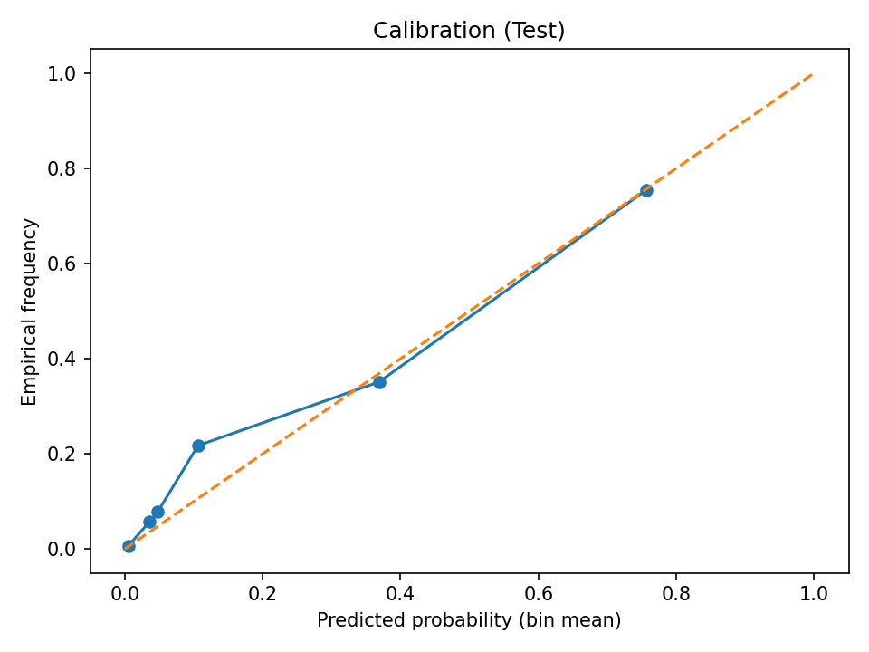
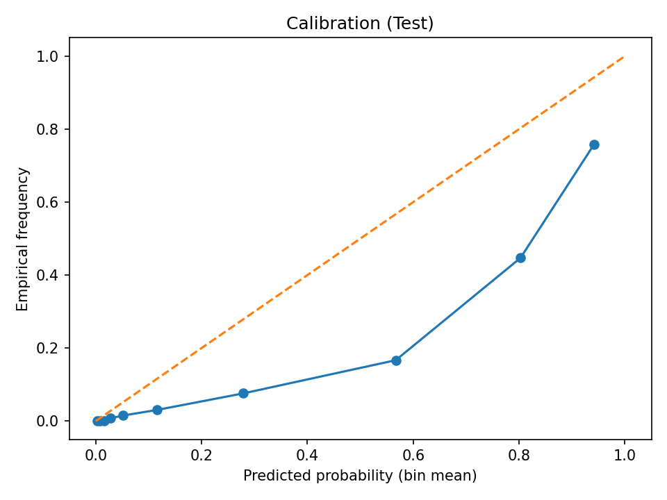

# F1 Podium Predictor

Predicting Formula 1 podium finishes (top-3 results) using historical race data (1950–2023).  

This project uses leakage prevention techniques, feature engineering, calibration of probabilities, and model robustness across seasons and circuits.

## Project Overview
- **Goal:** Predict whether a driver will finish on the podium (top-3).  
- **Dataset:** Formula 1 World Championship (1950–2023)  
- **Approach:**  
  - Season-based splits (train ≤ 2018, validate 2019–2020, test 2021–2023).  
  - Leakage prevention and rolling features for driver/team.
  - Models: Logistic Regression and XGBoost, with Isotonic Calibration for Probability Quality.  
  - Baselines: Simple grid-position rule (predict the starting 3 drivers on the grid get podium).

## Key Results
| Model                  | PR-AUC | Brier Score | F1@opt |
|-------------------------|--------|-------------|--------|
| Baseline (grid ≤ 3)     | 0.41   | 0.133       | 0.60   |
| Logistic Regression     | 0.63   | 0.108       | 0.60   |
| Logistic Reg (Calibr.)  | 0.61   | **0.085**   | 0.60   |
| XGBoost                 | **0.74** | 0.105     | **0.69** |
| XGBoost (Calibrated)    | 0.70   | **0.069**   | **0.69** |

**Takeaway:**  
- XGBoost nearly doubled PR-AUC vs baseline (0.41 → 0.74).  
- Calibration cut Brier loss in half (0.133 → 0.069).
- F1 on unseen test seasons reached 0.69.

## Example Outputs
Raw Calibration:  

  

Calculated Calibration:  

  

XGBoost Calibration:  

  

## Example Outputs
You can run predict_example.py to see an example of a model prediction. This script takes a random row from the complete dataset and prints out its information, expected output, and actual output.

Run this script to see the model in action!

## How to Run
1. Clone the repo and install requirements:  
   git clone https://github.com/dylanjcurran/F1-Podium-Predictor.git  
   cd F1-Podium-Predictor  
   pip install -r requirements.txt  

2. Dataset CSVs are in `data/raw/`.  
   - Joined Dataset is in `data/processed/`  

3. Run the pipeline:  
   python scripts/run_model.py  

4. Outputs are written to `outputs/`:  
   - metrics.json, MODEL_REPORT.md  
   - calibration plots  
   - threshold sweeps  
   - per-season & per-circuit breakdowns  
   - feature importance CSV

## License
This project is licensed under the MIT License — see LICENSE for details.
