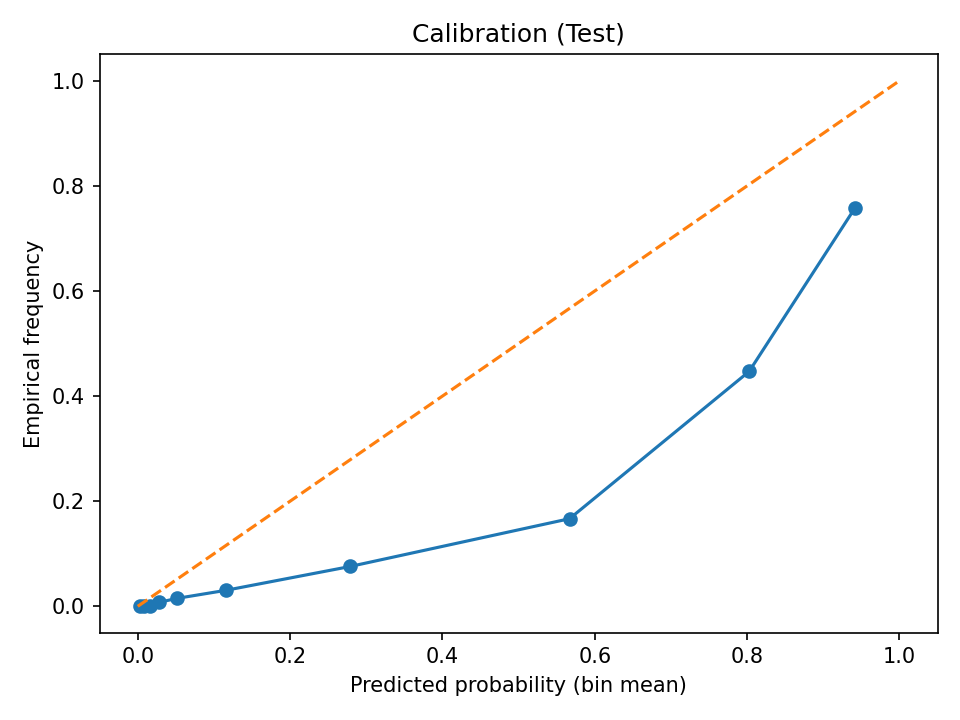

# F1 Podium Predictor — Model Report

**Splits** — Train 1950–2018, Val 2019–2020, Test 2021–2023

## Baseline (grid ≤ 3)
- Val: pr_auc: 0.502, f1@0.5: 0.678, brier: 0.104
- Test: pr_auc: 0.410, f1@0.5: 0.596, brier: 0.133

## Logistic Regression
- Val: pr_auc: 0.643, brier: 0.103, f1@0.5: 0.654, f1@opt: 0.694, opt_threshold: 0.750
- Test: pr_auc: 0.628, brier: 0.108, f1@0.5: 0.587, f1@opt: 0.601
- Calibrated Test: pr_auc: 0.607, brier: 0.085, f1@0.5: 0.601, f1@opt: 0.600

## XGBoost
- Val: pr_auc: 0.739, brier: 0.099, f1@0.5: 0.667, f1@opt: 0.736, opt_threshold: 0.750
- Test: pr_auc: 0.741, brier: 0.105, f1@0.5: 0.637, f1@opt: 0.687
- Calibrated Test: pr_auc: 0.697, brier: 0.069, f1@0.5: 0.631, f1@opt: 0.688

